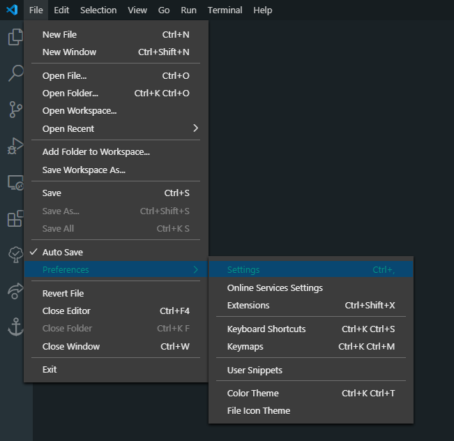
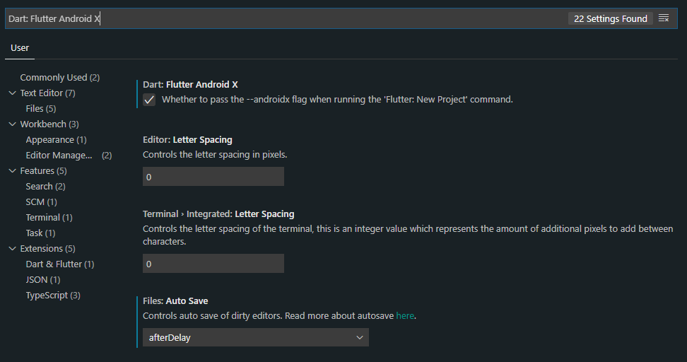
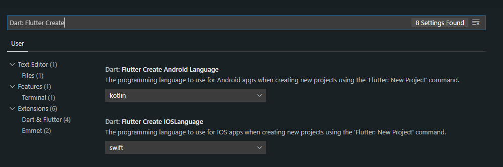
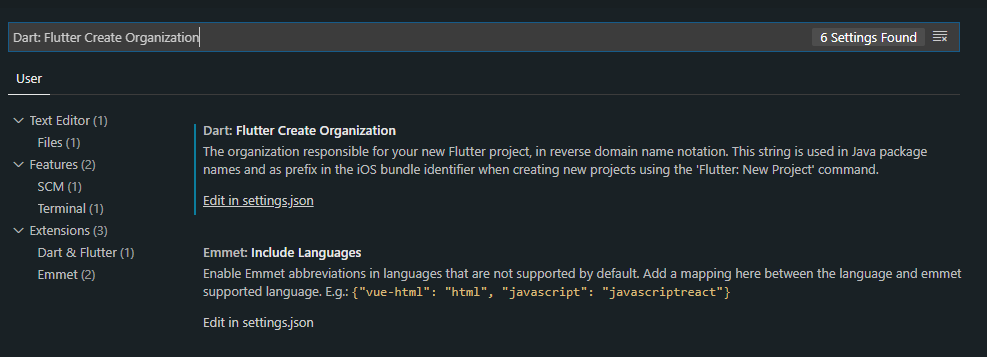
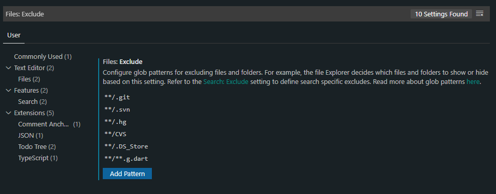
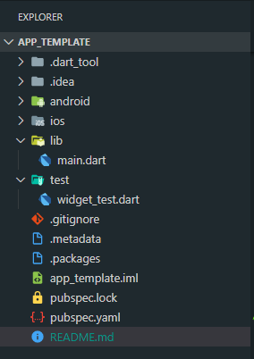
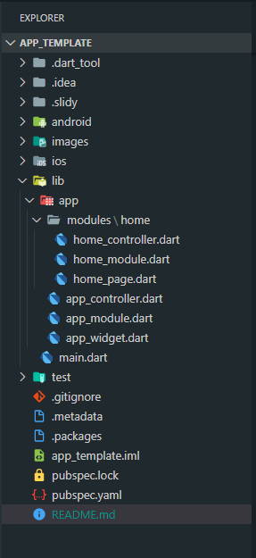

 

# Flutter Hhelp: Padrão de Projeto (02 jun 2020)

## Sobre "Padrão de Projeto"

Esse projeto reúne guias e documentações para padronizar os **Aplicativos** feitos em Flutter da Hhelp. O padrão deverá estar de acordo para todos os desenvolvedores.

## Documentação oficial

1. [Instalação Flutter](https://flutter.dev/docs/)
2. [Pacotes](https://pub.dev/)
3. [Instalação Slidy](https://pub.dev/packages/slidy)
4. [Mobx](https://pub.dev/packages/mobx)

## Pré-requisitos: Software e Hardware

- Ambiente com Windows10/Linux ou Mac OS Catalina. Sendo que os primeiros  permitem a construção de apps somente em Android, e o último permite apps em Android e IOS.

- Caso seu sistema possua menos de 8GB de RAM, poderá ser necessário que disponha de um smartphone onde será instalado o app para teste. Isso ocorre devido ao consumo dos emuladores.

- Requisitos adicionais aparecem no guia de [Instalação Flutter](https://flutter.dev/docs/). Ex.: Android Studio, Xcode para Mac OS, Visual Studio Code.

## Instalação

Para garantir a atualização da versão do Flutter SDK (no momento 1.17), recomendo que sigam a documentação de referência do [Flutter](https://flutter.dev/docs/get-started/install). Nele você aprenderá a instalar e configurar o ambiente de execução básico.

> [!IMPORTANT]
> Os passos a seguir seguem a partir da escolha do Visual Studio Code como editor de código.

### Extensões VSCODE

- Dart e Flutter (**Necessário**): Ambas necessárias para trabalhar com Flutter.

- Material Icon Theme por Philipp Kief (**Opcional**): Usa ícones intuitivos para estruturar o projeto.

- Rainbow Brackets por 2agua (**Opcional**): Demarca os intervalos de () e {} com cores. Pode utilizar algum outro semelhante.

- Error Lens por Alexander (**Opcional**): Exibe o texto de erro ao lado da linha em que ocorre sem precisar sobrepor o mouse.

- flutter_mobx por Flutterando (**Opcional/Recomendado**): Provê um alias para a geração de Código do Mobx.

- Comment Anchors por Exodius Studios (**Opcional/Recomendado**): Esse plugin permite marcar comentários como TODO, REVIEW e FIXME. Os trechos comentados com as tags podem ser rastreadas pelo ícone da extensão.

> [!NOTE]
> O Rainbow Indent desativa a marcação de identação padrão do dart. Por isso, não o inseri na lista.

### Configuração VSCODE

1. Acesse **File -> Preferences -> Settings**.



2. Procure a opção "Dart: Flutter Android X" e marque. Isso faz com que o próximo projeto iniciado suporte compatibilidade com a versão X.




3. Procure agora pela opção "Dart: Flutter Create". Ira aparecer tanto para Android Language quanto IOS Language. Escolha respectivamente Kotlin e Swift. O motivo é que o Android Studio escolhe essas linguagens para configurar o projeto.



4. Procure também por "Dart: Flutter Create Organization". Você verá a opção de editar .json. Adicione nesse arquivo o nome da organização que é usada para gerar os pacotes em android e ios. Adicionei por exemplo "br.hhelp"




```json
...
    "dart.flutterCreateOrganization": "br.hhelp",
...
```

5. Por fim, procure por "File Exclude" e adicione o padrão \*\*/\*\*.g.dart. Os arquivos .g.dart são gerados pelo [Mobx](https://pub.dev/packages/mobx) e não devem ser alterados pelo usuário. O File exclude apenas oculta esse formato da lista de arquivos no seu workspace.



### Instalar Slidy

O [Slidy](https://pub.dev/packages/slidy) funciona como um gerenciador de pacotes para o Dart. Ele é necessário para criamos nosso padrão de modularização de código. Siga os passos da documentação ofical para obtê-lo através **SDK DART**.

## Iniciando o Projeto em Flutter

1. No VSCODE Abra o "Command Pallete" (Ctrl + Shift + P no Windows10, Command   + Shift + P no Mac OS).

2. Entre com "Flutter New Project".

3. Escolha o nome e local do seu projeto. Como exemplo criei um **app_template**. Você terá essa estrutura:



4. Vamos modificar agora essa estrutura para trabalharmos com Modules. Abra o terminal interno do VSCODE já na raiz do projeto e execute:

> [!IMPORTANT]
> Você precisa ter configurado corretamento o Slidy e o adicionado ao PATH.

```shell
slidy start
```

5. Selecione na ordem:
```shell
flutter_modular (default)

mobx (default)

yes
```
6. Caso alguns arquivos apresentem erro, é devido à geração de código do Mobx. Você pode corrigir esse erro de duas formas: A primeira é clicando sobre o alias (barra de ferrmenta no canto inferior da tela) gerado pela extensão **flutter_mobx** e a segunda é executando o seguinte código no terminal:

```shell
flutter pub get & flutter pub run build_runner build --delete-conflicting-outputs
```

7. Se tudo ocorreu sem erros, você terá a estrutura criada em Modular. Para mantê-la, é importante criar novos modulos usando o slidy. A estrutura atual do projeto deve se parecer com:




## Adicionando Novos Componentes ao Projeto

Se você executou os passos corretamente até aqui, já tem uma estrutura para desenvolvimento do app. Vamos agora aumentar a organização deixando a estrutura mais robusta. Abaixo serão listadas as pastas criadas. Note a identação como forma de indicar sub diretórios.

- assets : Arquivos de imagem e fontes
- lib/shared : Arquivos que podem ser compartilhados entre todos os modules. 
- lib/i18n : Arquivos para suporte de multiplos idiomas
- lib/shared/database : Arquivos para guardar os repositórios que serão usados para comunicar com os bancos de dados
- lib/shared/docs : Arquivos para conter documentação auxiliar
- lib/shared/guard : Arquivos sensíveis que não podem ser comitados. Ex.: Chaves de APIs, Tokens, etc. Adicione no .gitignore o coódigo abaixo.
```shell
...
# Guard
/lib/shared/guard/**.dart
```
- lib/shared/models : Arquivos com modelos das entidades usadas
- lib/shared/style : Arquivos para padronização de fontes, cores, responsividade do layout.
- lib/shared/utils : Arquivos para funções e classes utiliatárias. Ex.: Conversores, serviços nativos como ligação.

``` dart
├───assets
├ ...
├───lib
│   ├───app
│   │   └───modules
│   │       └───home
│   └───shared
│       ├───database
│       ├───docs
│       ├───guard
│       ├───models
│       ├───style
│       └───utils
└...
```

## Boas Práticas

### Arquivos de Style
É interessante dedicar um arquivo à padronização de Widgets como *Text* e *TextStyle*, além de cores para o tema do app. Isso permite a troca centralizada de aspectos essenciais ao front-end. Nesse projeto de template, adicionei um breve exemplo na pasta **lib/shared/style** que foi retirado desse [post](https://medium.com/flutter-community/flutter-responsive-ui-for-learning-platform-app-2df185f86e8e).

### Criação de Diretórios
Para nomear os diretórios, use o padrão de separação com underline, seja nome de arquivo ou pasta, e sempre **minemônico**. Por exemplo, o arquivo para configuração de responsividade poderá ser nomeado como ***responsive_config.dar***.

### Nomeação de Classes, Métodos e Variaveis
Aqui não tem muito segredo, podemos usar o padrão CamelCase adotado no Java.

### Uso do Slidy
O slidy pode ser usado muito além da estrutura inicial. Você pode também usá-lo para instalar pacotes, gerar novas pages, widgets e controllers. Na parte de [Comandos Utéis](#comandos-utis) estão alguns comandos que você pode usar.

## Comandos Utéis
Sempre que surgir um comando que facilite o trabalho da equipe, ele pode e deve ser documentado aqui.

|Comando  |Parâmetros  |Resultado  |Observação  |
|---------|---------|---------|---------|
|flutter run     |         |Realiza deploy no emulador ou device|         |
|slidy i <package-name\>| Nome do pacote baseado no pub.dev      |Instala um pacote no projeto com a última versão|         |
|slidy g <type\> <path\> -c| Tipo de geração automática, podendo ser module, page. Caminho onde será gerado o arquivo.  |Geração automática de código padrão Modular + Mobx|         |


## Referências
As referências podem ser divididas entre documentos em texto e vídeos, da forma que for mais didática e confiável.

### Documentos
1. [Medium Flutter Community](https://medium.com/flutter-community)

2. [Flutter Responsivo - Padrão de estilo](https://medium.com/flutter-community/flutter-responsive-ui-for-learning-platform-app-2df185f86e8e)

3. [Cursos](https://balta.io/carreiras/flutter-mobile-developer)

4. [Mobx](https://balta.io/blog/flutter-mobx)

5. [Modular](https://github.com/Flutterando/modular)


### Vídeos
1. [Flutter Ofical Youtube](https://www.youtube.com/channel/UCwXdFgeE9KYzlDdR7TG9cMw). Dica: Assista "Widget of the Week".

2. [Criando Seu Primeiro App](https://www.youtube.com/watch?v=dA8Bbzw0_lo&list=PLHlHvK2lnJndhgbqLl5DNEvKQg5F4ZenQ)

3. [Mobx na Prática](https://www.youtube.com/watch?v=quYU0q4DVwQ&list=PLR5GUTqrcwXim6ZCDvRpsak8CB8_mreCE)

4. [Flutter Safe Area Responsivo](https://www.youtube.com/watch?v=FQlZQGWJC58)

5. [Navegação de Rotas com Modular](https://www.youtube.com/watch?v=xUNYglMLOj0)

6. [Entendendo Stores](https://www.youtube.com/watch?v=hIXQYI34PXY)